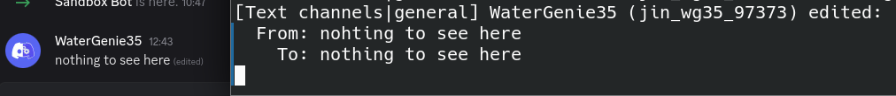

# Discord Bot Sandbox


## Demo Features

### Simple Message Echo

[]()

### Simple Edit Echo

[]()

### Image Search

Using API calls to fetch an image from a search engine.

[]()

### Web Scraping

Scraping website and presenting them in digestible format.  
This example collects news data from Sky Sports website.

[]()

### Event Monitoring

Monitoring live events and updating on Discord.  

#### Dummy Data
This example used randomly generated data at random interval.

[]()

#### RSS Feed
This example tracks an RSS feed and displays any new updates.

[]()


## Setup

```bash
python -m venv venv
source venv/bin/activate
pip install -r requirements.txt
```

- Put discord bot token in the `.env` file as shown in `.env.example`


## Run

```bash
source venv/bin/activate
python src/hello_world.py
```
